<div align="center">

> **Design principle:** *Automation should assist academic staff, not hide decisions from them.*

---

## 📑 Table of Contents

1. [Project Administration](#1-project-administration)
2. [Abstract](#2-abstract)
3. [Problem Statement, Objectives &amp; Scope](#3-problem-statement-objectives--scope)
4. [Track Compliance &amp; Evaluation Map](#4-track-compliance--evaluation-map)
5. [Requirements Digest (SRS)](#5-requirements-digest-srs)
6. [System Architecture](#6-system-architecture)
7. [From Project to Product: Modular Design](#7-from-project-to-product-modular-design)
8. [Complex Problems &amp; How We Solve Them](#8-complex-problems--how-we-solve-them)
9. [Seating Engine Deep Dive](#9-seating-engine-deep-dive)
10. [Security Architecture &amp; RBAC](#10-security-architecture--rbac)
11. [Database Design](#11-database-design)
12. [UML &amp; Behavioural Design](#12-uml--behavioural-design)
13. [UI / UX Design](#13-ui--ux-design)
14. [Controller URL Map](#14-controller-url-map)
15. [Project Structure](#15-project-structure)
16. [Testing Strategy](#16-testing-strategy)
17. [12-Week Development Plan &amp; Progress](#17-12-week-development-plan--progress)
18. [Getting Started](#18-getting-started)
19. [Deliverables &amp; Viva Readiness](#19-deliverables--viva-readiness)
20. [Risks, Roadmap &amp; License](#20-risks-roadmap--license)

- [Appendix A: Infographic Generation Prompts](#appendix-a-infographic-generation-prompts)

---

## 1. Project Administration

| Field                   | Details                                                                              |
| ----------------------- | ------------------------------------------------------------------------------------ |
| **Project Title** | Seat-o-Matic: Automated Examination Seating Arrangement & Paper Distribution Manager |
| **Track**         | Website Application Track (JSP–Servlet, Tomcat 9, MySQL)                            |
| **Institution**   | Arya College of Engineering & IT (ACEIT), Jaipur                                     |
| **Project Guide** | `< Er. Ram Babu Buri >`                                                              |
| **Duration**      | 12 weeks (84 days) + 6-day finalization buffer = 90-day log                          |
| **Repository**    | `https://github.com/always-yash/Seat-o-Matic`                                      |

### Team Members

| # | Name                   | Enrollment      | Email                       | Mobile     |
| - | ---------------------- | --------------- | --------------------------- | ---------- |
| 1 | `Yash Choudhary`     | 24E1ARCSM30P187 | rundla.yash@gmail.com       | 8502006448 |
| 2 | `Ved Prakash Sharma` | 24E1ARCSM40P180 | vedsharma6377@gmail.com     | 7877145457 |
| 3 | `Shivesh Surolia`    | 24E1ARCSM40P152 | shiveshsurolia@gmail.com    | 6367340522 |
| 4 | `Shivraj Singh`      | 24E1ARCSM40P153 | 99shivrajsrathore@gmail.com | 7877138838 |
| 5 | `Sanjay Jangid`      | 24E1ARCSM30P146 | jangidsanjay@gmail.com      | 8118875541 |

### Module Ownership

| Module       | Name                                                         | Owner                           | Core responsibility                                                                                                                  |
| ------------ | ------------------------------------------------------------ | ------------------------------- | ------------------------------------------------------------------------------------------------------------------------------------ |
| **M1** | **Core: Authentication, Seating Engine & Integration** | **Yash Choudhary** (Lead) | Architecture, shared kernel, login/sessions/RBAC, seating & validation engines, manual override, plan locking, integration & release |
| **M2** | **Student & Academic Data**                            | **Shivesh Surolia**       | Students, branches, sections, semesters, subjects, CSV import/validation, eligibility data                                           |
| **M3** | **Examination & Room Management**                      | **Shivraj Singh**         | Examinations & lifecycle, rooms, seat grids, blocked seats, capacity, room-slot conflicts                                            |
| **M4** | **Paper Distribution & Invigilation**                  | **Sanjay Jangid**         | Question-paper sets, room-wise requirements, distribution & collection tracking, invigilator view                                    |
| **M5** | **Reports, Analytics & Audit**                         | **Ved Prakash Sharma**    | Reports, exports, conflict summary, analytics, audit trail, QA support                                                               |

---

## 2. Abstract

Seat-o-Matic is a web-based Examination Seating Arrangement and Question Paper Distribution Manager built on the Java web stack: JSP, Servlets and JDBC running on Apache Tomcat 9 with a MySQL 8 database, organised strictly around the Model–View–Controller (MVC) pattern. It addresses a problem that every educational institution solves repeatedly and, in most cases, manually: deciding, for every examination session, which student sits in which seat of which room. It must keep students of the same branch or subject apart, respect room capacities and blocked seats, and make sure that the right number of question papers reaches the right room.

In current practice this work is done in spreadsheets and word-processor tables, typically over several late hours before an examination. The process is slow, error-prone and opaque. Capacity overflows and duplicate allocations are discovered only on the day. Late changes ripple unpredictably through the chart. Nobody can later say who changed which seat or why, and paper requirements are estimated by hand. Seat-o-Matic replaces this with a controlled, auditable workflow that moves from student data to examination configuration, room and seat configuration, automatic allocation, conflict analysis, faculty review and manual adjustment, validation, approval and locking. It ends with paper-distribution tracking and printable reports.

The technical heart of the system is a constraint-aware seating engine written in pure Java. Rather than treating seating as a random shuffle, the engine models it as a constraint-satisfaction and optimisation problem. Hard constraints can never be violated: a seat holds at most one student, a student occupies at most one seat, capacity is never exceeded, only eligible students are placed, and blocked seats stay empty. Soft constraints are minimised using a weighted penalty score: same-branch and same-subject students should not sit adjacent, and distribution should stay balanced. Several candidate arrangements are produced with alternating and snake (zig-zag) traversal strategies. A reusable validation engine evaluates each one, and the best valid candidate is selected. When a perfect arrangement is mathematically impossible, the system says so, reporting the exact residual conflicts and the reason instead of claiming success. Faculty remain in control: every automatic decision can be previewed, overridden through a seat-map interface, re-validated and recorded in an audit trail before the plan is approved and locked.

Seat-o-Matic is deliberately engineered as a product, not a monolithic college assignment. The application is decomposed into five modules, each owned end to end by one team member: (1) Core, covering authentication, architecture, the seating engine and system integration; (2) Student and Academic Data; (3) Examination and Room Management; (4) Paper Distribution and Invigilation; and (5) Reports, Analytics and Audit. Every module has its own controllers, services, DAOs, models and views, owns its own database tables, and exposes only a small, published service interface to the others. Modules are developed and tested in isolation against those contracts, using stubs where a neighbour is not ready, and are then merged through a disciplined integration cycle. This mirrors how multi-team software is built in industry and keeps the whole system understandable, testable and maintainable.

The platform satisfies the mandatory Website Application Track requirements:

- **MVC separation:** servlets are controllers, JSP pages with JSTL are views, and POJOs, DAOs and services form the model.
- **Sessions:** fixation and timeout protection.
- **Validation:** server-side validation on every input.
- **Password hashing:** salted PBKDF2.
- **Role-based access control:** Admin, Faculty and Invigilator, enforced both in a servlet filter and in the service layer.
- **Responsive UI:** a Bootstrap 5 interface.

Data integrity is protected at several levels: foreign keys, unique constraints and indexes in MySQL; JDBC transactions around multi-step operations; and optimistic locking so that two users cannot silently overwrite one another's changes. Security measures include prepared statements against SQL injection, output encoding against XSS, CSRF tokens on state-changing requests, and an insert-only audit log.

Most of the code is written in pure Java: the MVC dispatch, the DAO and transaction layer, the seating and validation engines, and the security utilities. A deliberately small set of supporting libraries (JSTL, MySQL Connector/J, Apache Commons CSV, Gson, OpenPDF, SLF4J/Logback, JUnit 5 and Mockito) is used where re-implementation would add risk without learning value. The result is a deployable WAR with a documented SRS, UML and ER design, a tested seating engine, and a working end-to-end workflow that an examination cell could realistically adopt.

**Keywords:** Examination seating, constraint satisfaction, MVC, JSP, Servlet, JDBC, Tomcat 9, MySQL, RBAC, audit trail, modular architecture.

---

## 3. Problem Statement, Objectives & Scope

### 3.1 Problem Statement

Examination seating is prepared by hand in spreadsheets. The process breaks down when:

- several branches, sections and subjects share one session;
- room sizes and layouts differ, and some seats are blocked;
- same-branch or same-subject adjacency must be minimised;
- students are added, removed or reassigned late;
- question papers must be counted per room, including a buffer;
- faculty need a trustworthy record of every change.

### 3.2 Objectives

| ID | Objective                                                                               |
| -- | --------------------------------------------------------------------------------------- |
| O1 | Automate seat allocation under explicit hard and soft constraints                       |
| O2 | Never report a "perfect" arrangement when one is impossible; explain residual conflicts |
| O3 | Keep faculty in control through preview-validate-confirm manual overrides               |
| O4 | Provide an approval and locking workflow that prevents accidental changes               |
| O5 | Track question-paper requirements, distribution and collection per room                 |
| O6 | Give invigilators a restricted, room-scoped view                                        |
| O7 | Record every sensitive action in a tamper-resistant audit trail                         |
| O8 | Deliver the system as five independently developed, contract-integrated modules         |

### 3.3 Scope

| In scope                                 | Out of scope (future work)                |
| ---------------------------------------- | ----------------------------------------- |
| Students, exams, rooms, seat grids       | Student-facing login / hall-ticket portal |
| Automatic + manual seating, locking      | Timetable generation                      |
| Paper distribution & collection tracking | Online (on-screen) exam delivery          |
| Reports, exports, audit trail            | Biometric / QR attendance                 |
| RBAC for Admin, Faculty, Invigilator     | Mobile native apps                        |

---

## 4. Track Compliance & Evaluation Map

### 4.1 Mandatory Track Requirements

| Mandatory requirement              | How Seat-o-Matic satisfies it                                                                                                     |
| ---------------------------------- | --------------------------------------------------------------------------------------------------------------------------------- |
| **JSP–Servlet on Tomcat 9** | Servlet 4.0 / JSP 2.3 (`javax.*` namespace), packaged as a WAR, deployed on Tomcat 9                                            |
| **MySQL**                    | MySQL 8, InnoDB;`schema.sql` with FK, unique and index definitions                                                              |
| **MVC**                      | Servlets = Controller; JSP + JSTL under`WEB-INF/views` = View; POJOs + Service + DAO = Model. JSPs contain no scriptlets or SQL |
| **Sessions**                 | `HttpSession` with session-ID regeneration on login, idle timeout, `HttpOnly` / `Secure` / `SameSite` cookies             |
| **Validation**               | HTML5 client checks (usability only) + mandatory server-side validators in every service                                          |
| **Password hashing**         | PBKDF2-HMAC-SHA256, per-user random salt, configurable work factor, constant-time comparison (JDK`javax.crypto`)                |
| **Role-based access**        | `ADMIN` / `FACULTY` / `INVIGILATOR`, enforced in `AuthorizationFilter` **and** re-checked in services               |
| **Responsive UI**            | Bootstrap 5 grid, verified at ~360 px, 768 px and 1200 px widths                                                                  |

### 4.2 Evaluation (100 Marks) → Evidence in this Repository

| Component                     | Marks | Evidence                                                                                         |
| ----------------------------- | :---: | ------------------------------------------------------------------------------------------------ |
| Idea & Abstract               |   5   | [§2 Abstract](#2-abstract), `docs/abstract.pdf`                                                |
| SRS / Documentation           |  10  | `docs/SRS.pdf`, [§5 digest](#5-requirements-digest-srs), `docs/`                             |
| Design (Use-case, Class, ER)  |  10  | [§11 ER](#11-database-design), [§12 UML](#12-uml--behavioural-design), `docs/figures/`         |
| Weekly Progress               |  25  | [§17](#17-12-week-development-plan--progress), `docs/weekly-reports/`                          |
| Implementation & Code Quality |  20  | `src/main/java`, [§6](#6-system-architecture), [§7](#7-from-project-to-product-modular-design) |
| Testing                       |  10  | [§16](#16-testing-strategy), `src/test/java`, `docs/testing.md`                              |
| Presentation                  |  10  | `docs/Seat-o-Matic.pptx`, demo video                                                           |
| Demo & Viva (individual)      |  10  | [§19 viva map](#19-deliverables--viva-readiness)                                                 |

---

## 5. Requirements Digest (SRS)

> Full document: `docs/SRS.pdf`. The tables below summarise it.

### 5.1 Actors

| Actor                 | Description                                                                          |
| --------------------- | ------------------------------------------------------------------------------------ |
| **Admin**       | Manages users, master data, unlock operations, audit review                          |
| **Faculty**     | Configures exams, generates and adjusts seating, approves and locks, reviews reports |
| **Invigilator** | Views assigned rooms and seating, updates distribution/collection status             |

### 5.2 Functional Requirements (by owning module)

| Module                   | Requirements                                                                                                                                                                                                                                                                                                                                                                                         |
| ------------------------ | ---------------------------------------------------------------------------------------------------------------------------------------------------------------------------------------------------------------------------------------------------------------------------------------------------------------------------------------------------------------------------------------------------- |
| **M1 Core**        | **C01** login/logout with sessions · **C02** role-based access · **C03** generate seating using selectable strategy · **C04** report capacity shortfall precisely · **C05** detect conflicts and compute score · **C06** move/swap with preview and warnings · **C07** validate, approve, lock · **C08** regenerate (supersede previous plan) |
| **M2 Student**     | **S01** CRUD for students, branches, sections, semesters, subjects · **S02** unique enrollment numbers · **S03** CSV bulk import with row-level error report · **S04** active/inactive status · **S05** search, filter, paginate · **S06** eligible-student query for exams                                                                                 |
| **M3 Exam & Room** | **E01** exam CRUD (date, time) · **E02** register eligible students with subject · **E03** rooms as rows × columns · **E04** auto-generate seats · **E05** mark blocked seats · **E06** detect room/time-slot double-booking · **E07** exam lifecycle states                                                                                        |
| **M4 Paper**       | **P01** paper sets per exam/subject · **P02** per-room requirement + buffer (incl. mixed-subject rooms) · **P03** status workflow · **P04** collection tracking · **P05** invigilator assignment · **P06** room-scoped invigilator view                                                                                                                     |
| **M5 Reports**     | **R01** room-wise report · **R02** student-wise report · **R03** exam summary + conflict summary · **R04** paper report · **R05** CSV/PDF export · **R06** audit trail viewer with filters · **R07** analytics dashboard                                                                                                                             |

### 5.3 Non-Functional Requirements

| ID     | Category             | Requirement                                                                                                      |
| ------ | -------------------- | ---------------------------------------------------------------------------------------------------------------- |
| NFR-01 | Security             | Hashed passwords, CSRF, XSS/SQLi protection, backend authorization (see §10)                                    |
| NFR-02 | Integrity            | FK/unique constraints, transactions, optimistic locking                                                          |
| NFR-03 | Performance (target) | Generate a plan for ~1,000 students / ~30 rooms in seconds on development hardware; to be benchmarked in Week 10 |
| NFR-04 | Usability            | Responsive UI; actionable error messages; seat map readable at a glance                                          |
| NFR-05 | Maintainability      | Layered MVC, no scriptlets, one package per module, code conventions                                             |
| NFR-06 | Auditability         | Every generation, change, approval, lock/unlock and distribution update logged                                   |
| NFR-07 | Portability          | WAR on Tomcat 9; MySQL 8; configuration outside code                                                             |
| NFR-08 | Testability          | Engine and services testable without a container                                                                 |

---

## 6. System Architecture

### 6.1 MVC Mapping

| MVC role             | Implementation                                                              | Rule                                                                       |
| -------------------- | --------------------------------------------------------------------------- | -------------------------------------------------------------------------- |
| **Model**      | POJOs/DTOs,`*Service` (business rules + transactions), `*DAO` (JDBC)    | No servlet/JSP types inside the model                                      |
| **View**       | JSP + JSTL + EL under`WEB-INF/views/**`, Bootstrap 5, vanilla JS          | No Java scriptlets, no SQL, output always encoded                          |
| **Controller** | `HttpServlet` subclasses per module, built on a shared `BaseController` | Parse and validate request, call service, set attributes, forward/redirect |

Cross-cutting concerns are handled by **servlet filters**: character encoding, authentication, RBAC, CSRF verification, and audit context (user, IP, request id).

**Post-Redirect-Get** is used after every successful state-changing POST to prevent double submission.

### 6.2 Layered Architecture (Draft)

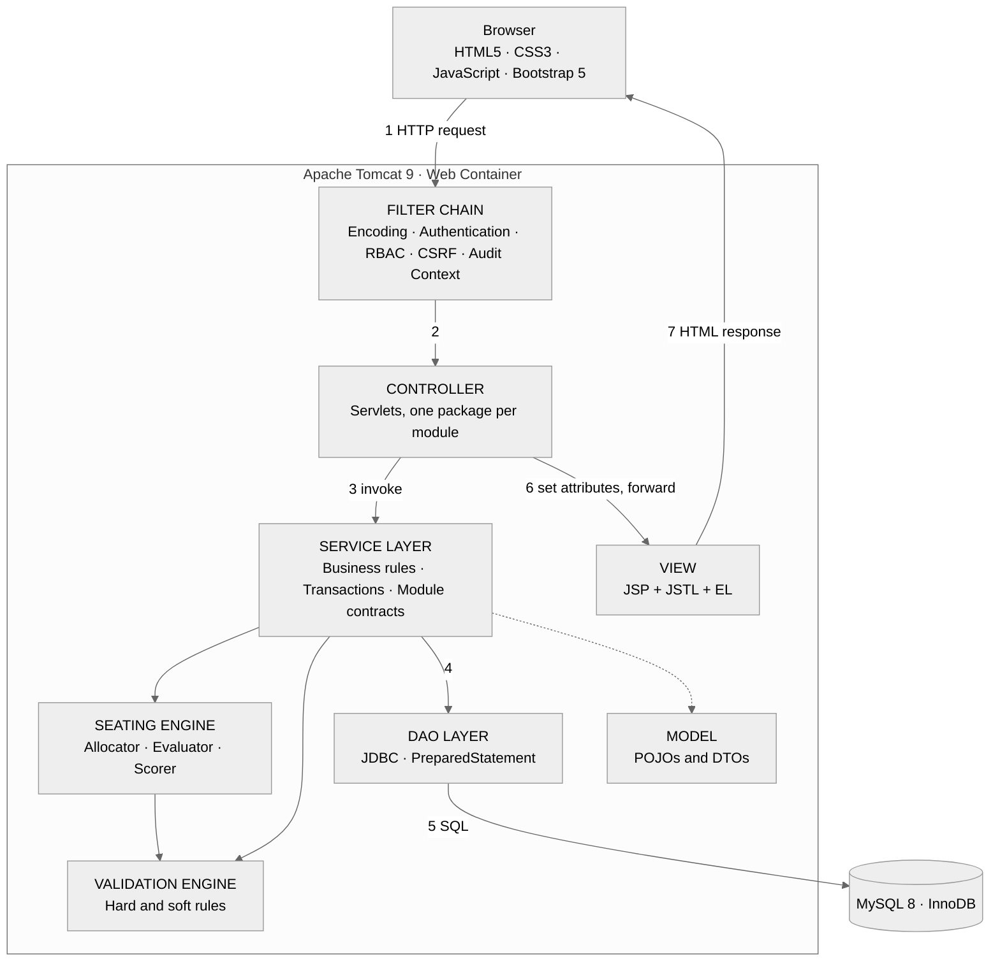

```text
┌──────────────────────────────────────────────────────────────────────┐
│ FIGURE 1 · LAYERED MVC SYSTEM ARCHITECTURE                            │
│ file: docs/figures/fig-01-architecture.png     prompt: Appendix A     │
│                                                                      │
│                                                                      │
│                   [ INSERT B/W INFOGRAPHIC HERE ]                    │
│                                                                      │
│                                                                      │
└──────────────────────────────────────────────────────────────────────┘
```

### 6.3 Data Flow Diagram, Level 1 (Draft)

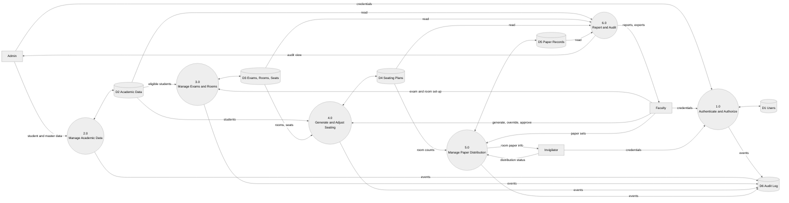

```text
┌──────────────────────────────────────────────────────────────────────┐
│ FIGURE 2 · DATA FLOW DIAGRAM (LEVEL 0 + LEVEL 1)                      │
│ file: docs/figures/fig-02-dfd.png              prompt: Appendix A     │
│                                                                      │
│                                                                      │
│                   [ INSERT B/W INFOGRAPHIC HERE ]                    │
│                                                                      │
│                                                                      │
└──────────────────────────────────────────────────────────────────────┘
```

### 6.4 Deployment View (Draft)

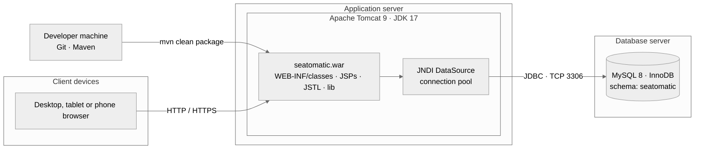

```text
┌──────────────────────────────────────────────────────────────────────┐
│ FIGURE 3 · DEPLOYMENT DIAGRAM                                         │
│ file: docs/figures/fig-03-deployment.png       prompt: Appendix A     │
│                                                                      │
│                                                                      │
│                   [ INSERT B/W INFOGRAPHIC HERE ]                    │
│                                                                      │
│                                                                      │
└──────────────────────────────────────────────────────────────────────┘
```

### 6.5 Pure Java vs. Aiding Libraries

The principle: **core logic is hand-written Java; libraries only where re-implementation adds risk but no learning value.**

| Concern                                 | Implementation                                                              | Type                      |
| --------------------------------------- | --------------------------------------------------------------------------- | ------------------------- |
| MVC dispatch, routing, forward/redirect | `HttpServlet`, `RequestDispatcher`, custom `BaseController`           | **Pure Java**       |
| Persistence                             | JDBC, DAO pattern,`PreparedStatement`                                     | **Pure Java**       |
| Transactions                            | Custom`TransactionManager` (`ThreadLocal<Connection>`, commit/rollback) | **Pure Java**       |
| Seating & validation engines            | Custom allocators, constraint objects, scorer                               | **Pure Java**       |
| Password hashing                        | `PBKDF2WithHmacSHA256` (`javax.crypto`), `SecureRandom` salt          | **Pure Java (JDK)** |
| Sessions, CSRF, RBAC filters            | `HttpSession`, custom filters and token manager                           | **Pure Java**       |
| Input validation                        | Custom`Validator` classes                                                 | **Pure Java**       |
| Connection pooling                      | Tomcat JNDI DataSource                                                      | Container-provided        |
| Views                                   | JSP 2.3 + JSTL 1.2                                                          | Spec / library            |
| CSV import                              | Apache Commons CSV                                                          | Library                   |
| JSON for seat-map AJAX                  | Gson                                                                        | Library                   |
| PDF export                              | OpenPDF                                                                     | Library                   |
| Logging                                 | SLF4J + Logback                                                             | Library                   |
| Testing                                 | JUnit 5, Mockito                                                            | Library                   |
| UI                                      | Bootstrap 5, vanilla JavaScript (`fetch`)                                 | Front-end library         |
| Build                                   | Maven (WAR packaging)                                                       | Tool                      |

---

## 7. From Project to Product: Modular Design

### 7.1 Product Principles

| Principle                                | What it means for us                                                                                                                                                  |
| ---------------------------------------- | --------------------------------------------------------------------------------------------------------------------------------------------------------------------- |
| **Module independence**            | Each module has its own`controller / service / dao / model` packages and owns its tables. Other modules never touch those tables directly.                          |
| **Contract-first**                 | Module boundaries are Java interfaces (`*QueryService`). Interfaces and DTOs are agreed and frozen *before* implementation (end of Week 2).                       |
| **Minimal shared kernel**          | `common/` contains only infrastructure (DB access, transactions, security utilities, base controller, exceptions, `AuditPublisher` interface). No business logic. |
| **One-way dependencies**           | Dependencies flow`M2 → M3 → M1 → M4 → M5`. No cycles. `M5` is read-only toward everyone else.                                                                 |
| **Dependency inversion for audit** | `AuditPublisher` is an interface in the kernel. Every module calls it. `M5` provides the implementation.                                                          |
| **Stub-driven parallel work**      | Until a neighbour is ready, each owner develops against a stub implementation of its interface.                                                                       |
| **Integration cadence**            | Weekly merge into`develop`; module branches `module/m1-core` … `module/m5-reports`; `main` holds only releasable builds.                                     |
| **Definition of Done**             | Code + unit tests + server-side validation + audit hook + docs + reviewed by one other member.                                                                        |

### 7.2 Module Map & Integration Contracts (Draft)

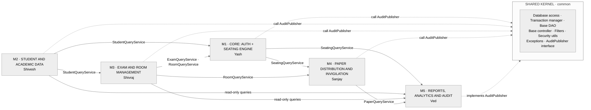

```text
┌──────────────────────────────────────────────────────────────────────┐
│ FIGURE 4 · FIVE MODULES → ONE PRODUCT (MODULE MAP + CONTRACTS)        │
│ file: docs/figures/fig-04-module-map.png       prompt: Appendix A     │
│                                                                      │
│                                                                      │
│                   [ INSERT B/W INFOGRAPHIC HERE ]                    │
│                                                                      │
│                                                                      │
└──────────────────────────────────────────────────────────────────────┘
```

### 7.3 Module Cards

#### M1: Core: Authentication, Seating Engine & Integration (Yash Choudhary, Lead)

| Attribute               | Detail                                                                                                                                                                                                                            |
| ----------------------- | --------------------------------------------------------------------------------------------------------------------------------------------------------------------------------------------------------------------------------- |
| **Scope**         | Architecture and shared kernel · login, sessions, RBAC filters · seating engine (alternating + snake) · validation engine · manual move/swap with preview · plan lifecycle (approve/lock/supersede) · integration & release |
| **Controllers**   | `LoginServlet`, `LogoutServlet`, `DashboardServlet`, `SeatingServlet`, `SeatMapDataServlet` (JSON)                                                                                                                      |
| **Views**         | `login.jsp`, `dashboard.jsp`, `seating/plan.jsp`, `seating/seatmap.jsp`                                                                                                                                                   |
| **Owns tables**   | `users`, `seating_plans`, `seat_assignments`, `plan_conflicts`                                                                                                                                                            |
| **Publishes**     | `AuthService`, `SeatingQueryService`                                                                                                                                                                                          |
| **Consumes**      | `StudentQueryService`, `ExamQueryService`, `RoomQueryService`, `AuditPublisher`                                                                                                                                           |
| **Hard problems** | Constraint optimisation · honest infeasibility reporting · transactional generation · optimistic locking · session security                                                                                                   |

#### M2: Student & Academic Data (Shivesh Surolia)

| Attribute               | Detail                                                                                                                                                                           |
| ----------------------- | -------------------------------------------------------------------------------------------------------------------------------------------------------------------------------- |
| **Scope**         | Students, branches, sections, semesters, subjects · active/inactive status · CSV bulk import with row-level validation · search/filter/pagination · eligible-student queries |
| **Controllers**   | `StudentServlet`, `BranchServlet`, `SectionServlet`, `SubjectServlet`, `StudentImportServlet`                                                                          |
| **Views**         | `student/list.jsp`, `student/form.jsp`, `student/import.jsp`, `academic/*.jsp`                                                                                           |
| **Owns tables**   | `branches`, `sections`, `semesters`, `subjects`, `students`                                                                                                            |
| **Publishes**     | `StudentQueryService` (`findEligible`, `countByGroup`, `getById`)                                                                                                        |
| **Consumes**      | `AuditPublisher`                                                                                                                                                               |
| **Hard problems** | Duplicate detection · safe import (validate-then-commit) · students in multiple subjects without duplication · referential guards on delete                                   |

#### M3: Examination & Room Management (Shivraj Singh)

| Attribute               | Detail                                                                                                                                                                                          |
| ----------------------- | ----------------------------------------------------------------------------------------------------------------------------------------------------------------------------------------------- |
| **Scope**         | Exam CRUD and lifecycle · eligibility registration (via M2) · rooms as rows × columns · seat generation · blocked seats · capacity calculation · room/time-slot double-booking detection |
| **Controllers**   | `ExamServlet`, `RoomServlet`, `SeatConfigServlet`                                                                                                                                         |
| **Views**         | `exam/list.jsp`, `exam/form.jsp`, `room/list.jsp`, `room/grid.jsp`                                                                                                                      |
| **Owns tables**   | `exams`, `exam_students`, `rooms`, `seats`                                                                                                                                              |
| **Publishes**     | `ExamQueryService`, `RoomQueryService`, `CapacityService`                                                                                                                                 |
| **Consumes**      | `StudentQueryService`, `AuditPublisher`                                                                                                                                                     |
| **Hard problems** | Seat-grid changes without orphaning assignments · overlapping-slot room conflicts · exam-state guards                                                                                         |

#### M4: Paper Distribution & Invigilation (Sanjay Jangid)

| Attribute               | Detail                                                                                                                                                                    |
| ----------------------- | ------------------------------------------------------------------------------------------------------------------------------------------------------------------------- |
| **Scope**         | Paper sets per exam/subject · per-room requirement with buffer · status workflow · distribution and collection tracking · invigilator assignment and room-scoped view |
| **Controllers**   | `PaperServlet`, `DistributionServlet`, `CollectionServlet`, `InvigilatorServlet`                                                                                  |
| **Views**         | `paper/sets.jsp`, `paper/distribution.jsp`, `invigilator/room.jsp`                                                                                                  |
| **Owns tables**   | `question_papers`, `paper_distribution`, `invigilator_assignments`                                                                                                  |
| **Publishes**     | `PaperQueryService`                                                                                                                                                     |
| **Consumes**      | `SeatingQueryService`, `RoomQueryService`, `AuditPublisher`                                                                                                         |
| **Hard problems** | Mixed-subject rooms (per-subject counts) · legal status transitions · invigilator can see only assigned rooms (IDOR prevention)                                         |

#### M5: Reports, Analytics & Audit (Ved Prakash Sharma)

| Attribute               | Detail                                                                                                                                                                                                           |
| ----------------------- | ---------------------------------------------------------------------------------------------------------------------------------------------------------------------------------------------------------------- |
| **Scope**         | `AuditPublisher` implementation and audit viewer · room-wise, student-wise, exam, paper and conflict reports · analytics dashboard · CSV/PDF export · QA support (regression checklists, shared test data) |
| **Controllers**   | `ReportServlet`, `ExportServlet`, `AuditServlet`, `AnalyticsServlet`                                                                                                                                     |
| **Views**         | `report/*.jsp`, `audit/list.jsp`, `analytics/dashboard.jsp`                                                                                                                                                |
| **Owns tables**   | `audit_logs` (+ read-only SQL views)                                                                                                                                                                           |
| **Publishes**     | `AuditPublisher` (impl), `ReportService`                                                                                                                                                                     |
| **Consumes**      | All`*QueryService` interfaces (read-only)                                                                                                                                                                      |
| **Hard problems** | Insert-only audit log · report query performance (no N+1) · streaming large exports · consistent snapshots                                                                                                    |

### 7.4 Integration Strategy

1. **Weeks 1–2:** freeze interfaces, DTOs and table ownership (`docs/contracts.md`).
2. **Weeks 3–7:** each owner builds and unit-tests their module against stubs.
3. **Week 7 onward:** stubs are replaced by real implementations through a weekly integration build on `develop`.
4. **Week 8:** cross-module defect sweep (IDs, API contracts, UI states).
5. **Week 9:** regression suite on every merge; contract tests assert each module's published interface behaves as documented.
6. **Weeks 11–12:** release candidate, demo data, final regression, tag `v1.0`.

---

## 8. Complex Problems & How We Solve Them

| #  | Problem                                               | Why it is hard                                                                                                                  | Our solution                                                                                                                                      | Module |
| -- | ----------------------------------------------------- | ------------------------------------------------------------------------------------------------------------------------------- | ------------------------------------------------------------------------------------------------------------------------------------------------- | :----: |
| 1  | **Optimal seating under constraints**           | Placing groups so no two conflicting students are adjacent resembles graph colouring / quadratic assignment: NP-hard in general | Deterministic heuristics (alternating, snake) + N seeded candidates + weighted scoring + best-valid selection. Reproducible and explainable.      |   M1   |
| 2  | **Impossible instances**                        | 28 of branch A + 2 of branch B can never be fully separated                                                                     | Distinguish hard vs soft constraints; report residual conflicts with reasons instead of failing or lying                                          |   M1   |
| 3  | **Atomic multi-table operations**               | Generation writes plan + assignments + conflicts + audit; partial failure corrupts state                                        | Custom`TransactionManager` (`setAutoCommit(false)`, commit/rollback in `finally`); single transaction per workflow                          |   M1   |
| 4  | **Concurrent edits**                            | Two faculty members move seats in the same plan                                                                                 | Optimistic locking:`UPDATE … WHERE id=? AND version=?`; zero rows updated → conflict error and reload                                         |   M1   |
| 5  | **Regeneration without duplicate active plans** | Old assignments must not coexist with new ones                                                                                  | Mark previous plan`SUPERSEDED` in the same transaction; lock the exam row (`SELECT … FOR UPDATE`) to serialise regenerations                 |   M1   |
| 6  | **Cross-module consistency**                    | A student or room may be deleted while referenced elsewhere                                                                     | FK constraints + service-level guards (`StudentInUseException`) + soft-delete (active/inactive)                                                 | M2, M3 |
| 7  | **Room double-booking**                         | Same room used by overlapping exams                                                                                             | Time-interval overlap query on exam-room usage; blocks or warns before generation                                                                 |   M3   |
| 8  | **Seat-grid edits after assignment**            | Shrinking 5×6 → 4×6 would orphan seats                                                                                       | Block structural edits when a non-superseded plan references the room; require regeneration                                                       |   M3   |
| 9  | **Safe bulk import**                            | Malformed, duplicate or partial CSV data                                                                                        | Streaming parse → validate every row → commit valid rows in one transaction → downloadable error report; optional strict (all-or-nothing) mode |   M2   |
| 10 | **Mixed-subject rooms**                         | A room holds several subjects; one paper count is wrong                                                                         | Count papers per (room, subject) from assignments; add configurable buffer per subject                                                            |   M4   |
| 11 | **Illegal workflow transitions**                | `PENDING → VERIFIED` would skip steps                                                                                        | Explicit transition table enforced in service; invalid transition → rejected and audited                                                         |   M4   |
| 12 | **Horizontal privilege escalation (IDOR)**      | Invigilator edits URL to view another room                                                                                      | Service-level ownership check against`invigilator_assignments`, not just role check                                                             | M4, M1 |
| 13 | **Tamper-resistant audit**                      | Application bugs or insiders could alter history                                                                                | App DB user granted`SELECT, INSERT` only on `audit_logs`; no update/delete path in code                                                       |   M5   |
| 14 | **Report performance**                          | Naïve loops create N+1 queries on large exams                                                                                  | Joined/aggregate SQL, indexes, pagination; streamed CSV/PDF export                                                                                |   M5   |
| 15 | **Parallel-development drift**                  | Five people, five modules, mismatched IDs and contracts                                                                         | Contract-first interfaces, stubs, weekly integration, contract tests                                                                              |  All  |
| 16 | **Session security**                            | Fixation, hijack, forgotten logout                                                                                              | `changeSessionId()` on login, idle timeout, hardened cookies, CSRF tokens                                                                       |   M1   |

---

## 9. Seating Engine Deep Dive

### 9.1 Problem Model

| Item                       | Definition                                                                                                                                                          |
| -------------------------- | ------------------------------------------------------------------------------------------------------------------------------------------------------------------- |
| **Inputs**           | Eligible students (branch, section, subject) · rooms · non-blocked seats · adjacency policy · strategy · weights · candidate count                            |
| **Hard constraints** | one student per seat · one seat per student · capacity respected · only eligible students · blocked seats never used · every seat belongs to a configured room |
| **Soft constraints** | same-branch not adjacent · same-subject not adjacent · balanced distribution · avoid concentrating a group                                                       |
| **Outputs**          | Arrangement · per-room seat chart · conflict list · score · shortfall (if any)                                                                                  |

### 9.2 Strategies

```text
ALTERNATING (2 groups)        SNAKE / ZIG-ZAG (3 groups)
A B A B A B                   A B C A B C   →
B A B A B A                   ← C B A C B A
                              A B C A B C   →
```

Alternating suits two or three groups. Snake traversal reverses direction on alternate rows to break column-wise repetition. Both are *baselines*: the engine generates several seeded variants and scores them.

### 9.3 Adjacency Policies

| Policy         | Neighbours checked     |
| -------------- | ---------------------- |
| `LEFT_RIGHT` | W, E                   |
| `FOUR_WAY`   | N, S, W, E             |
| `EIGHT_WAY`  | N, S, W, E + diagonals |

### 9.4 Scoring

```
Score = (HardViolations × VERY_HIGH)
      + (SameSubjectAdjacency × W_subject)
      + (SameBranchAdjacency  × W_branch)
      + (DistributionImbalance × W_balance)        lower is better
```

Any candidate with a hard violation is discarded regardless of score.

### 9.5 Algorithm Flow (Draft)

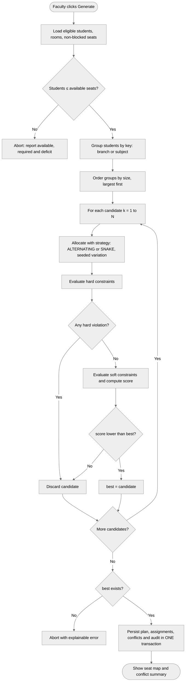

```text
┌──────────────────────────────────────────────────────────────────────┐
│ FIGURE 5 · SEATING ALGORITHM FLOWCHART                                │
│ file: docs/figures/fig-05-algorithm-flow.png   prompt: Appendix A     │
│                                                                      │
│                                                                      │
│                   [ INSERT B/W INFOGRAPHIC HERE ]                    │
│                                                                      │
│                                                                      │
└──────────────────────────────────────────────────────────────────────┘
```

### 9.6 Core Pseudocode (Java-style)

```java
public SeatingPlan generate(long examId, GenerationConfig cfg, long userId) {
    InputBundle in = loadInputs(examId);                       // via M2/M3 service interfaces
    CapacityReport cap = validationEngine.checkCapacity(in);   // hard pre-check
    if (!cap.isSufficient()) throw new CapacityShortfallException(cap);

    Map<GroupKey, List<Student>> groups = grouper.group(in.students(), cfg.groupingKey());
    Candidate best = null;
    for (int k = 0; k < cfg.candidateCount(); k++) {
        Arrangement a = allocator(cfg.strategy()).allocate(groups, in.seats(), cfg.seed() + k);
        EvaluationReport r = validationEngine.evaluate(a, cfg.adjacency());
        if (r.hardViolations() > 0) continue;                  // correctness before optimisation
        int score = scorer.score(r, cfg.weights());
        if (best == null || score < best.score()) best = new Candidate(a, r, score);
    }
    if (best == null) throw new NoValidArrangementException(in, cfg);

    return tx.execute(() -> {                                  // one atomic unit of work
        planDao.supersedeActive(examId);
        SeatingPlan plan = planDao.insert(examId, best, userId);
        assignmentDao.insertAll(plan.id(), best.arrangement());
        conflictDao.insertAll(plan.id(), best.report());
        audit.record(userId, "GENERATE_PLAN", "seating_plan", plan.id(), null, plan.summary());
        return plan;
    });
}
```

```java
// Optimistic locking inside PlanDao
int rows = ps.executeUpdate();  // UPDATE seating_plans SET status=?, version=version+1 WHERE id=? AND version=?
if (rows == 0) throw new ConcurrentModificationException("Plan was changed by another user. Reload.");
```

### 9.7 Manual Override Flow (Draft)

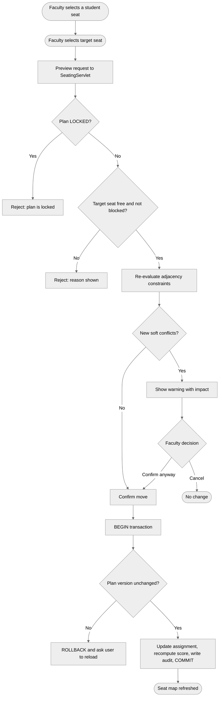

```text
┌──────────────────────────────────────────────────────────────────────┐
│ FIGURE 6 · MANUAL OVERRIDE ACTIVITY DIAGRAM (SWIMLANES)               │
│ file: docs/figures/fig-06-manual-override.png  prompt: Appendix A     │
│                                                                      │
│                                                                      │
│                   [ INSERT B/W INFOGRAPHIC HERE ]                    │
│                                                                      │
│                                                                      │
└──────────────────────────────────────────────────────────────────────┘
```

---

## 10. Security Architecture & RBAC

### 10.1 RBAC Matrix

| Capability                              | ADMIN |  FACULTY  |     INVIGILATOR     |
| --------------------------------------- | :---: | :-------: | :-----------------: |
| Manage users and master data            |  ✅  |    ❌    |         ❌         |
| Manage students / import CSV            |  ✅  |    ✅    |         ❌         |
| Create/configure exams and rooms        |  ✅  |    ✅    |         ❌         |
| Generate / regenerate seating           |  ❌  |    ✅    |         ❌         |
| Move / swap seats                       |  ❌  |    ✅    |         ❌         |
| Approve / lock plan                     |  ❌  |    ✅    |         ❌         |
| Unlock plan                             |  ✅  |    ❌    |         ❌         |
| View seating                            |  ✅  |    ✅    | Assigned rooms only |
| Update distribution / collection status |  ❌  |    ✅    | Assigned rooms only |
| View reports / export                   |  ✅  |    ✅    |         ❌         |
| View audit trail                        |  ✅  | Own exams |         ❌         |

> **Hidden buttons are not security.** The `AuthorizationFilter` checks the URL → role map, and every service method re-checks the role and resource ownership.

### 10.2 Threat → Control

| Threat                            | Control                                                                                                                             |
| --------------------------------- | ----------------------------------------------------------------------------------------------------------------------------------- |
| SQL injection                     | `PreparedStatement` only; no string-concatenated SQL                                                                              |
| XSS                               | `<c:out>` / `fn:escapeXml` everywhere; no scriptlets; `Content-Security-Policy` header                                        |
| CSRF                              | Per-session synchronizer token verified by`CsrfFilter` on all POSTs                                                               |
| Session fixation                  | `request.changeSessionId()` on successful login                                                                                   |
| Session hijack                    | `HttpOnly`, `Secure`, `SameSite` cookies; idle timeout; logout invalidates session                                            |
| Credential stuffing / brute force | Failed-attempt counter with temporary lockout; every attempt audited                                                                |
| Weak password storage             | PBKDF2-HMAC-SHA256, unique 16-byte salt, configurable work factor (OWASP guidance: ≥ 600,000 iterations), constant-time comparison |
| IDOR                              | Ownership checks in services (e.g. invigilator ↔ room)                                                                             |
| Direct JSP access                 | All JSPs under`WEB-INF/views`; reachable only through controllers                                                                 |
| Information leakage               | Custom error pages in`web.xml`; stack traces logged, never shown                                                                  |
| Clickjacking                      | `X-Frame-Options: DENY`                                                                                                           |
| Malicious upload                  | CSV only, size-limited, parsed as data, never executed or stored in web root                                                        |
| Audit tampering                   | App DB user has`SELECT, INSERT` only on `audit_logs`                                                                            |

---

## 11. Database Design

### 11.1 Table Ownership

| Module         | Tables                                                                   |
| -------------- | ------------------------------------------------------------------------ |
| M1 Core        | `users`, `seating_plans`, `seat_assignments`, `plan_conflicts`   |
| M2 Student     | `branches`, `sections`, `semesters`, `subjects`, `students`    |
| M3 Exam & Room | `exams`, `exam_students`, `rooms`, `seats`                       |
| M4 Paper       | `question_papers`, `paper_distribution`, `invigilator_assignments` |
| M5 Audit       | `audit_logs`                                                           |

### 11.2 Entity-Relationship Diagram (Draft)

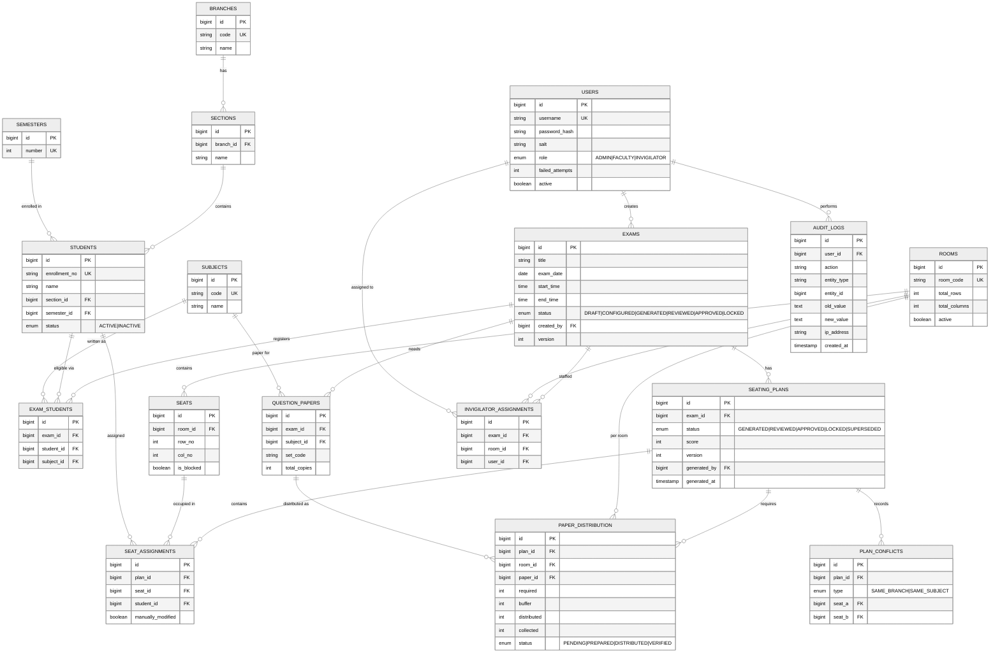

```text
┌──────────────────────────────────────────────────────────────────────┐
│ FIGURE 7 · ER DIAGRAM, GROUPED BY MODULE (M1–M5)                      │
│ file: docs/figures/fig-07-er.png               prompt: Appendix A     │
│                                                                      │
│                                                                      │
│                   [ INSERT B/W INFOGRAPHIC HERE ]                    │
│                                                                      │
│                                                                      │
└──────────────────────────────────────────────────────────────────────┘
```

### 11.3 Integrity Rules

| Rule                                  | Mechanism                                                                                             |
| ------------------------------------- | ----------------------------------------------------------------------------------------------------- |
| Unique enrollment number              | `UNIQUE (students.enrollment_no)`                                                                   |
| One student per seat per plan         | `UNIQUE (seat_assignments.plan_id, seat_id)`                                                        |
| One seat per student per plan         | `UNIQUE (seat_assignments.plan_id, student_id)`                                                     |
| One registration per student per exam | `UNIQUE (exam_students.exam_id, student_id)`                                                        |
| One definition per grid cell          | `UNIQUE (seats.room_id, row_no, col_no)`                                                            |
| Valid references                      | Foreign keys on every relation                                                                        |
| Atomic workflows                      | JDBC transactions                                                                                     |
| Concurrent edits                      | `version` column on `exams` and `seating_plans`                                                 |
| Immutable audit                       | `GRANT SELECT, INSERT ON seatomatic.audit_logs TO 'seatomatic_app'@'localhost';` (no UPDATE/DELETE) |

### 11.4 Key DDL (excerpt)

```sql
CREATE TABLE seating_plans (
  id           BIGINT AUTO_INCREMENT PRIMARY KEY,
  exam_id      BIGINT NOT NULL,
  status       ENUM('GENERATED','REVIEWED','APPROVED','LOCKED','SUPERSEDED') NOT NULL DEFAULT 'GENERATED',
  score        INT NOT NULL,
  version      INT NOT NULL DEFAULT 0,
  generated_by BIGINT NOT NULL,
  generated_at TIMESTAMP NOT NULL DEFAULT CURRENT_TIMESTAMP,
  CONSTRAINT fk_plan_exam FOREIGN KEY (exam_id) REFERENCES exams(id),
  CONSTRAINT fk_plan_user FOREIGN KEY (generated_by) REFERENCES users(id),
  INDEX idx_plan_exam_status (exam_id, status)
) ENGINE=InnoDB;

CREATE TABLE seat_assignments (
  id                BIGINT AUTO_INCREMENT PRIMARY KEY,
  plan_id           BIGINT NOT NULL,
  seat_id           BIGINT NOT NULL,
  student_id        BIGINT NOT NULL,
  manually_modified TINYINT(1) NOT NULL DEFAULT 0,
  CONSTRAINT fk_sa_plan    FOREIGN KEY (plan_id)    REFERENCES seating_plans(id) ON DELETE CASCADE,
  CONSTRAINT fk_sa_seat    FOREIGN KEY (seat_id)    REFERENCES seats(id),
  CONSTRAINT fk_sa_student FOREIGN KEY (student_id) REFERENCES students(id),
  CONSTRAINT uq_plan_seat    UNIQUE (plan_id, seat_id),
  CONSTRAINT uq_plan_student UNIQUE (plan_id, student_id)
) ENGINE=InnoDB;
```

> **Modelling note:** `exam_students.subject_id` lets one examination session hold several subjects. This is what makes "same-subject adjacency" meaningful.

---

## 12. UML & Behavioural Design

### 12.1 Use-Case Diagram (Draft)

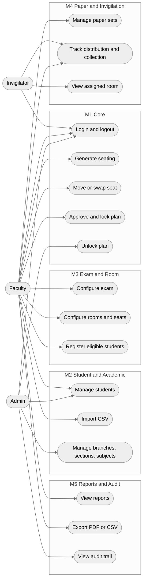

```text
┌──────────────────────────────────────────────────────────────────────┐
│ FIGURE 8 · USE-CASE DIAGRAM                                           │
│ file: docs/figures/fig-08-use-case.png         prompt: Appendix A     │
│                                                                      │
│                                                                      │
│                   [ INSERT B/W INFOGRAPHIC HERE ]                    │
│                                                                      │
│                                                                      │
└──────────────────────────────────────────────────────────────────────┘
```

### 12.2 Class Diagram: Seating Subsystem (Draft)

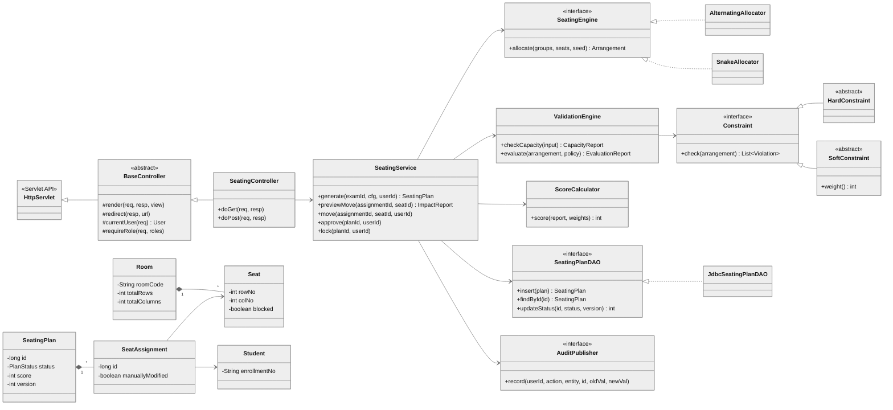

```text
┌──────────────────────────────────────────────────────────────────────┐
│ FIGURE 9 · CLASS DIAGRAM (CONTROLLER · SERVICE · ENGINE · DAO · MODEL)│
│ file: docs/figures/fig-09-class.png            prompt: Appendix A     │
│                                                                      │
│                                                                      │
│                   [ INSERT B/W INFOGRAPHIC HERE ]                    │
│                                                                      │
│                                                                      │
└──────────────────────────────────────────────────────────────────────┘
```

### 12.3 Sequence Diagram: Generate Seating through MVC (Draft)

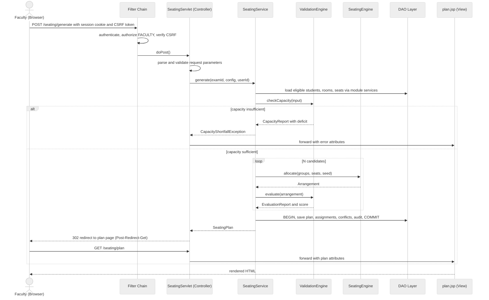

```text
┌──────────────────────────────────────────────────────────────────────┐
│ FIGURE 10 · SEQUENCE DIAGRAM: GENERATE SEATING                        │
│ file: docs/figures/fig-10-sequence.png         prompt: Appendix A     │
│                                                                      │
│                                                                      │
│                   [ INSERT B/W INFOGRAPHIC HERE ]                    │
│                                                                      │
│                                                                      │
└──────────────────────────────────────────────────────────────────────┘
```

### 12.4 Examination / Plan Lifecycle (Draft)

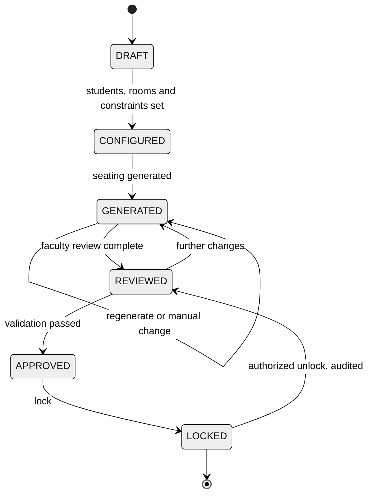

```text
┌──────────────────────────────────────────────────────────────────────┐
│ FIGURE 11 · STATE DIAGRAM: EXAM AND PLAN LIFECYCLE                    │
│ file: docs/figures/fig-11-state.png            prompt: Appendix A     │
│                                                                      │
│                                                                      │
│                   [ INSERT B/W INFOGRAPHIC HERE ]                    │
│                                                                      │
│                                                                      │
└──────────────────────────────────────────────────────────────────────┘
```

---

## 13. UI / UX Design

### 13.1 Design System

| Aspect         | Decision                                                                                                                   |
| -------------- | -------------------------------------------------------------------------------------------------------------------------- |
| Framework      | Bootstrap 5 grid and components, custom CSS tokens                                                                         |
| Responsiveness | Mobile-first; tables collapse to cards below 768 px; seat map scrolls/zooms on small screens                               |
| Layout         | JSP include / tag files for header, sidebar (role-aware), footer, flash messages                                           |
| Accessibility  | Semantic HTML, labelled inputs, keyboard-focusable seats, contrast-safe seat states (not colour alone: icons and patterns) |
| Feedback       | Inline validation messages, flash banners after redirect, explicit conflict explanations                                   |
| JavaScript     | Vanilla JS +`fetch` for seat-map data and move preview only                                                              |

### 13.2 Screen Inventory

| #  | Screen                                    | Role                 | Module |
| -- | ----------------------------------------- | -------------------- | :----: |
| 1  | Login                                     | All                  |   M1   |
| 2  | Dashboard (role-aware)                    | All                  |   M1   |
| 3  | Student list / form / import              | Admin, Faculty       |   M2   |
| 4  | Branch / Section / Subject manager        | Admin                |   M2   |
| 5  | Exam list / setup / eligibility           | Faculty              |   M3   |
| 6  | Room list / grid designer / blocked seats | Faculty              |   M3   |
| 7  | **Seating workspace (seat map)**    | Faculty              |   M1   |
| 8  | Conflict summary                          | Faculty              |   M5   |
| 9  | Paper sets / distribution board           | Faculty, Invigilator |   M4   |
| 10 | Invigilator room view                     | Invigilator          |   M4   |
| 11 | Reports + export                          | Admin, Faculty       |   M5   |
| 12 | Audit trail                               | Admin                |   M5   |

### 13.3 Wireframe: Seating Workspace (Draft)

```text
┌──────────────────────────────────────────────────────────────────────┐
│ Seat-o-Matic   ▸ Data Structures Mid-Term ▸ Room C-204   [GENERATED] │
├──────────────────────────────────────────────────────────────────────┤
│                         ▔▔▔▔▔▔  BOARD  ▔▔▔▔▔▔                         │
│            C1     C2     C3     C4     C5     C6                     │
│       R1  [CSE]  [ECE]  [ME ]  [CSE]  [ECE]  [ME ]                   │
│       R2  [ME ]  [CSE]  [ECE]  [ME ]  [CSE]  [ECE]                   │
│       R3  [ECE]  [ME ]  [CSE]  [ECE]  [ME ]  [CSE]⚠  ← conflict      │
│       R4  [CSE]  [ECE]  [ME ]  [CSE]  [ECE]  [ ▒ ]   ← blocked seat  │
│       R5  [ME ]  [CSE]  [ECE]  [ME ]  [CSE]  [ECE]                   │
│                                                                      │
│  Legend: [ ] available  [XXX] assigned  [▣] selected  ⚠ conflict     │
│          [✎] modified   [🔒] locked      [▒] blocked                  │
├───────────────────────────────┬──────────────────────────────────────┤
│ Score: 18   Hard: PASSED      │ Same-branch: 3 · Same-subject: 1     │
├───────────────────────────────┴──────────────────────────────────────┤
│ [Move] [Swap] [Regenerate Room] [Validate] [Approve] [Lock 🔒]       │
└──────────────────────────────────────────────────────────────────────┘
```

### 13.4 Mock-up Slots

```text
┌──────────────────────────────────────────────────────────────────────┐
│ FIGURE 12 · UI MOCK-UP SHEET (DESKTOP)  8 key screens                 │
│ file: docs/figures/fig-12-ui-desktop.png       prompt: Appendix A     │
│                                                                      │
│                                                                      │
│                                                                      │
│                   [ INSERT B/W MOCK-UPS HERE ]                       │
│                                                                      │
│                                                                      │
│                                                                      │
└──────────────────────────────────────────────────────────────────────┘
```

```text
┌──────────────────────────────────────────────────────────────────────┐
│ FIGURE 13 · UI MOCK-UP SHEET (MOBILE ~360 px)  login, dashboard,      │
│ invigilator room view, seat map                                       │
│ file: docs/figures/fig-13-ui-mobile.png        prompt: Appendix A     │
│                                                                      │
│                   [ INSERT B/W MOCK-UPS HERE ]                       │
│                                                                      │
│                                                                      │
└──────────────────────────────────────────────────────────────────────┘
```

---

## 14. Controller URL Map

All URLs sit under the context path `/seatomatic`. State-changing requests are `POST` and require a CSRF token.

| Module | URL pattern                                              |  Method  | Roles                  | Purpose                    |
| :----: | -------------------------------------------------------- | :------: | ---------------------- | -------------------------- |
|   M1   | `/login`                                               | GET/POST | Public                 | Login form / authenticate  |
|   M1   | `/logout`                                              |   POST   | Any                    | Invalidate session         |
|   M1   | `/dashboard`                                           |   GET   | Any                    | Role-aware dashboard       |
|   M1   | `/seating/plan?examId=`                                |   GET   | Faculty, Admin, Invig* | View plan and seat map     |
|   M1   | `/seating/generate`                                    |   POST   | Faculty                | Generate plan              |
|   M1   | `/seating/preview-move`                                |   POST   | Faculty                | Impact preview (JSON)      |
|   M1   | `/seating/move` · `/seating/swap`                   |   POST   | Faculty                | Apply manual change        |
|   M1   | `/seating/validate` · `/approve` · `/lock`       |   POST   | Faculty                | Lifecycle transitions      |
|   M1   | `/seating/unlock`                                      |   POST   | Admin                  | Unlock plan                |
|   M1   | `/seating/data?planId=`                                |   GET   | Faculty, Admin, Invig* | Seat-map JSON              |
|   M2   | `/students` · `/students/form`                      | GET/POST | Admin, Faculty         | List, create, update       |
|   M2   | `/students/import`                                     | GET/POST | Admin, Faculty         | CSV import + error report  |
|   M2   | `/academic/branches` · `/sections` · `/subjects` | GET/POST | Admin                  | Master data                |
|   M3   | `/exams` · `/exams/form`                            | GET/POST | Admin, Faculty         | Exam CRUD                  |
|   M3   | `/exams/eligibility`                                   | GET/POST | Faculty                | Register students/subjects |
|   M3   | `/rooms` · `/rooms/grid`                            | GET/POST | Admin, Faculty         | Rooms and seat grid        |
|   M4   | `/papers`                                              | GET/POST | Faculty                | Paper sets                 |
|   M4   | `/distribution`                                        | GET/POST | Faculty, Invig*        | Distribution / collection  |
|   M4   | `/invigilator/room`                                    |   GET   | Invigilator            | Assigned room view         |
|   M5   | `/reports/{room                                          | student | exam                   | paper}`                    |
|   M5   | `/reports/export?type=&format=`                        |   GET   | Admin, Faculty         | CSV / PDF stream           |
|   M5   | `/analytics`                                           |   GET   | Admin, Faculty         | Dashboard                  |
|   M5   | `/audit`                                               |   GET   | Admin, Faculty (own)   | Audit viewer               |

\* Invigilator access is limited to rooms assigned to that user.

---

## 15. Project Structure

```
Seat-o-Matic/
├── README.md · LICENSE · .gitignore · pom.xml        (packaging: war)
│
├── docs/
│   ├── abstract.pdf · SRS.pdf · contracts.md · database.md · testing.md
│   ├── figures/                    # fig-01 … fig-13 (B/W)
│   ├── weekly-reports/             # one folder per week
│   └── viva-notes/                 # per-member
│
├── database/
│   ├── schema.sql · sample-data.sql · seed-admin.sql
│   └── grants.sql                  # least-privilege app user, insert-only audit
│
├── screenshots/
│
└── src/
    ├── main/
    │   ├── java/com/seatomatic/
    │   │   ├── common/                         # SHARED KERNEL (no business logic)
    │   │   │   ├── db/        DataSourceProvider · TransactionManager · BaseDao
    │   │   │   ├── web/       BaseController · Flash · JsonResponse
    │   │   │   ├── filter/    EncodingFilter · AuthenticationFilter · AuthorizationFilter · CsrfFilter · AuditContextFilter
    │   │   │   ├── security/  PasswordHasher · CsrfTokenManager · Role
    │   │   │   ├── audit/     AuditPublisher (interface)
    │   │   │   ├── exception/ domain exceptions + ErrorMapper
    │   │   │   └── util/
    │   │   ├── core/                           # M1 (Yash)
    │   │   │   ├── auth/      LoginServlet · LogoutServlet · AuthService · UserDao
    │   │   │   └── seating/   controller · service · engine/ (allocator, evaluator, scorer, constraint) · dao · model
    │   │   ├── student/                        # M2 (Shivesh)  controller · service · dao · model · importer
    │   │   ├── exam/                           # M3 (Shivraj)  controller · service · dao · model
    │   │   ├── paper/                          # M4 (Sanjay)   controller · service · dao · model
    │   │   ├── report/                         # M5 (Ved)      controller · service · dao · export · audit
    │   │   └── tools/         HashPassword.java
    │   │
    │   ├── resources/         logback.xml · messages.properties
    │   └── webapp/
    │       ├── META-INF/context.xml            # JNDI DataSource (no credentials in code)
    │       ├── WEB-INF/
    │       │   ├── web.xml                     # filters, error pages, session config
    │       │   ├── views/<module>/*.jsp        # not directly reachable
    │       │   └── tags/                       # layout + reusable tag files
    │       └── assets/        css · js · img
    │
    └── test/java/com/seatomatic/               # mirrors main; per-module test packages
```

---

## 16. Testing Strategy

| Level                                   | Scope                                                                                           | Tools                           |
| --------------------------------------- | ----------------------------------------------------------------------------------------------- | ------------------------------- |
| **Unit**                          | Allocators, constraints, scorer, validators, paper calculation, state machines, password hasher | JUnit 5                         |
| **Service**                       | Business rules with mocked DAOs / module interfaces                                             | JUnit 5 + Mockito               |
| **DAO integration**               | SQL, constraints, transactions against a dedicated MySQL test schema                            | JUnit 5 + JDBC                  |
| **Controller**                    | Servlets with mocked`HttpServletRequest/Response`                                             | Mockito                         |
| **Contract**                      | Every published`*QueryService` behaves as documented (run on each merge)                      | JUnit 5                         |
| **Security**                      | Role × URL matrix, CSRF, XSS, SQL injection probes                                             | JUnit 5 + manual scripts        |
| **End-to-end (manual, scripted)** | Login → data → exam → generate → adjust → lock → papers → reports                        | Checklist in`docs/testing.md` |

**Target:** ≥ 80% line coverage on the engine and service packages.

### Representative Test Cases

| ID     | Module | Scenario                                   | Expected result                                                     |
| ------ | :----: | ------------------------------------------ | ------------------------------------------------------------------- |
| TC-C01 |   M1   | 5 consecutive wrong passwords              | Account temporarily locked; attempts audited                        |
| TC-C02 |   M1   | Faculty forges POST to an admin-only URL   | 403; no state change                                                |
| TC-C03 |   M1   | 137 students, capacity 120                 | Generation refused; deficit of 17 reported                          |
| TC-C04 |   M1   | 28 × branch A + 2 × branch B in 30 seats | Plan produced; hard PASSED; residual conflicts reported with reason |
| TC-C05 |   M1   | Move student to occupied seat              | Rejected with explanation                                           |
| TC-C06 |   M1   | Two users act on the same plan version     | Second gets "plan changed, reload"                                  |
| TC-C07 |   M1   | Edit a LOCKED plan                         | Rejected and audited                                                |
| TC-S01 |   M2   | CSV: 100 rows, 3 invalid                   | 97 imported; downloadable error report lists 3 rows                 |
| TC-S02 |   M2   | Duplicate enrollment number                | Rejected with clear message                                         |
| TC-S03 |   M2   | Delete student with seat assignment        | Blocked; suggest deactivate                                         |
| TC-E01 |   M3   | Two exams, same room, overlapping times    | Conflict reported                                                   |
| TC-E02 |   M3   | Shrink room grid used by active plan       | Blocked; regeneration required                                      |
| TC-E03 |   M3   | Blocked seat                               | Never assigned                                                      |
| TC-P01 |   M4   | Room with 3 subjects (12/10/8) + buffer    | Per-subject counts and totals correct                               |
| TC-P02 |   M4   | Skip`PENDING → VERIFIED`                | Rejected                                                            |
| TC-P03 |   M4   | Invigilator requests another room          | 403                                                                 |
| TC-R01 |   M5   | Report totals vs. assignments              | Equal                                                               |
| TC-R02 |   M5   | `UPDATE audit_logs` using app DB user    | Denied by database                                                  |
| TC-R03 |   M5   | Export 5,000 rows                          | Streams without memory spike                                        |
| TC-X01 |  All  | `<script>` in student name               | Rendered inert everywhere                                           |
| TC-X02 |  All  | `' OR 1=1 --` in search                  | No effect                                                           |
| TC-X03 |  All  | POST without CSRF token                    | 403                                                                 |

---

## 17. 12-Week Development Plan & Progress

> The portal's **10-week checkpoints** (abstract → SRS → UML → DB + UI → coding → integration/testing → report/PPT/video) are covered inside this 12-week plan plus a 6-day finalization buffer. Weekly detail lives in `docs/weekly-reports/`.

### 17.1 Timeline (Draft)

```mermaid
%%{init: {'theme':'neutral'}}%%
gantt
    dateFormat YYYY-MM-DD
    axisFormat %d %b
    title 12-Week Plan + Finalization Buffer
    section Research
```
